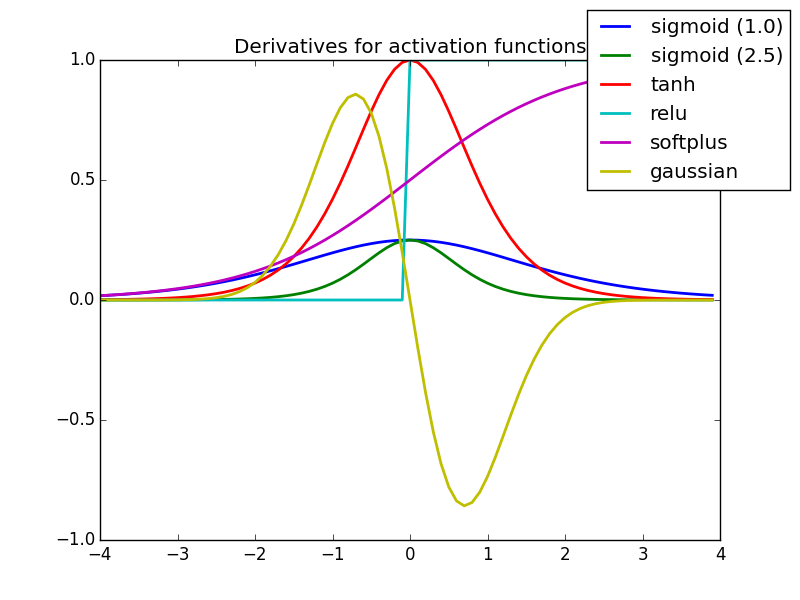

## 激活函数

📰 ***激活函数能够决定当前信息是否有用***

🆎 种类有：Sigmoid,Tanh,Relu,LeakyRelu, and so on......

种类可以被分为：线性激活函数和非线性激活函数

- Sigmoid
  
  
  $\phi(z)=$

$$\cos(2\theta)=cost^2\theta - sin^2\theta$$

$$\lim\limits_{x \to \infty}$$

- 特点：
  
  1. 将值压缩到 **(0,1)**之间，且绝对值越大，越靠近0/1的边缘
  
  优点：
  
  1. 平滑，有良好的**可导性**，利于梯度下降算法的梯度信息传递
  2. **倒数**简单，基于计算
  3. 因值域为（0,1），可以作为概率，辅助模型进行计算
  
  缺点：
  
  1. 梯度小于1，反向传播容易造成梯度消失（Vanishing Gradient Problem）
  
  2. ❓输出数据非原点对称，导致梯度更新朝着不同方向走很远，`0 < output <1` 使参数更新变得很困难，表现为收敛速度过慢。
  
     参考链接：
  
     [谈谈激活函数以零为中心的问题](https://liam.page/2018/04/17/zero-centered-active-function/)
  
     [激活函数以零为中心的影响](https://blog.csdn.net/sinat_41132860/article/details/83545726)
  
  3. ❓sigmoid函数饱和并能够让梯度快速消失
  
  4. sigmoid函数收敛速度很慢
  
  $$
  {f}' = f * (1-f)
  $$
  
- tanh

  
  $$
  tanh(x) = 2*sigmoid(x)-1
  $$
  
  特点：
  
  1. 只是sigmoid函数的简单变形
  2. ❓主要用于二分类问题
  3. ❓sigmoid和tanh都只用在前馈神经网络(feed-forward network)
  
  优点：
  
  1. 能够解决数据对称问题，这样参数更新将会变得更快一些
  2. 平滑，易于求导（与Sigmoid相似）
  
  缺点：
  
  1. 梯度消失的问题还是没有解决
  
- relu

  
  
  特点：
  
  1. 是当前最热的激活函数，特别是在CNN和DeepLearning中。
  
     基本上所有的DeepLearning模型激活函数都是使用的Relu
  
  2. 只有当 ***x*** 大于0时，数据才被**激活**。反之该信号直接被**切断**。
  
  优点：
  
  1. 收敛速度是`Tanh`的`6`倍。
  
  缺点：
  
  1. 导致信号被一刀切，从而没有**微弱的信号**。
  
  2. 容易导致(Dying Relu Problem)
  
     Relu神经元在training的过程中是很脆弱的，很容易**die**：此神经单元可能永远不会被激活（`x-value` 永远小于0）。特别是你的`learning-rate`设置的较大或`bias`特别小时，你会发现你的神经元**死掉**的比例会很大，甚至能够达到`40%`。
  
     激活函数好比一个信号筛选器，不同信号有不同的激活值，可是当所有的信号都是0，便失去了信号筛选的功能，即表现为**死掉**。
     
  3. 只能被用在`hidden layer`。

- LeakyRelu

  

  特点：

  1. 右图可见，相比于`Relu`，`LeakyRelu`对于**不激活的信号**依然会产生**微弱的信号**，而这个微弱系数(`a`)为`0.0`。
  2. 

### 为啥非得要用激活函数

神经网络，顾名思义是模拟人类大脑神经系统结构。人类大脑是通过轴突释放神经递质，下一个神经元的树突接受神经递质的信号后，经过一些列复杂的**处理**后，再选择性的传递一定的神经递质给其连接的其它神经元。

激活函数对于神经网络来说至关重要，是神经网络非线性化的关键步骤，在各种神经网络模型中，几乎每一层每一个`neural cell`都可以看到激活函数的身影。有了激活函数的非线性表达能力，神经网络理论上来讲，可以表达为**任何**复杂的函数。

> 非线性表达包含线性表达

**假如**我们不用激活函数，神经网络的非线性表达能力直接被砍掉，最终成为一个**线性回归模型**，这将是一个多么恐怖的事情。

另外，激活函数应该是**可微**的，这样才能使用`BackPropagation`算法，

### 最后来回答问题

> 我们该选哪个激活函数好呢？

在隐藏层，我们优先使用`Relu`，如果发现神经单元大面积**死亡**(Dead Neurons)，则需要使用`Leaky Relu`或`Maxout`函数。

因为梯度消失的问题，我们尽量不在隐藏层使用`Sigmoid`和`Tanh`。

****

🤖 接下来我想谈几个问题

❔ **激活函数的以零为中心的问题?**

不以零为中心的输出值，会导致训练效果变慢，即收敛速度变慢。为了解释清楚这个问题，我从**收敛速度**和**sigmoid参数更新方式**两个方面来讲。

- 收敛速度

  

  如果右下角的点是目标参数值的话，那么绿色的直线将是最短的收敛路径，可是如果方法不当，通常我们的收敛路径却是红色线段的轨迹甚至会更长。故我们的目标就是要尽量减少收敛的路径的长度。$f(x)=x$

  

参考文章：

[Activation Functions in Neural Networks](https://towardsdatascience.com/activation-functions-neural-networks-1cbd9f8d91d6)

[Activation functions and it’s types-Which is better?](https://towardsdatascience.com/activation-functions-and-its-types-which-is-better-a9a5310cc8f)

[Gradient Descent: Convergence Analysis](http://www.stat.cmu.edu/~ryantibs/convexopt-F13/scribes/lec6.pdf)

[谈谈激活函数以零为中心的问题](https://liam.page/2018/04/17/zero-centered-active-function/)