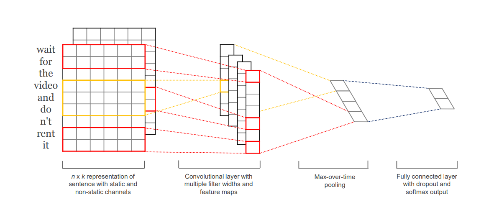

# TextCNN 到底学到了什么

此篇文章适合于已经对TextCNN有初步了解之后的同学**仔细**阅读。

> 在写完在文本分类领域目前常见的入门模型之后，发现把基础知识点做好才是真正帮助大家的好博文，所以，接下来，我将深入讲述`TextCNN`中的细节问题

就目前而言，深度神经网络仍然是一个黑盒，无法解释其中的工作原理，更无法精确的了解每个模型和每个参数对模型运行过程中的影响 ，只能够通过`Loss`函数和其它度量指标来判断**结果**的好坏。

故此，**玄学调参**营运而生，目前很多机器学习算法工程师，很多时间都花在了不停的调试多种参数，

有学者就[`TextCNN到底学到了什么`]( https://arxiv.org/pdf/1801.06287.pdf )做了深入研究，在此我将其中我所理解的知识点分享给大家，如果有什么错误，请在评论区指正，谢谢各位大佬！

## TextCNN 模型图



以上为[TextCNN](https://arxiv.org/abs/1408.5882 )论文中的模型介绍图，可是这些让模型搬瓦工就不是很友好了，下面这张图看着就清晰多了。

## TextCNN 层次图


## 复现代码

```python
import torch
import torch.nn as nn
import torch.nn.functional as F
from torch.autograd import Variable


class TextCNN(nn.Module):
    
    def __init__(self):
        super(TextCNN, self).__init__()
        filter_sizes = [1,2,3,5]
        num_filters = 36
        self.embedding = nn.Embedding(max_features, embed_size)
        self.embedding.weight = nn.Parameter(torch.tensor(embedding_matrix, dtype=torch.float32))
        self.embedding.weight.requires_grad = False
        self.convs1 = nn.ModuleList([nn.Conv2d(1, num_filters, (K, embed_size)) for K in filter_sizes])
        self.dropout = nn.Dropout(0.1)
        self.fc1 = nn.Linear(len(Ks)*num_filters, 1)


    def forward(self, x):
        x = self.embedding(x)  
        x = x.unsqueeze(1)  
        x = [F.relu(conv(x)).squeeze(3) for conv in self.convs1] 
        x = [F.max_pool1d(i, i.size(2)).squeeze(2) for i in x]  
        x = torch.cat(x, 1)
        x = self.dropout(x)  
        logit = self.fc1(x)  
        return logit
```

好，相信之前了解过TextCNN的同学，现在立马能够回忆起其中的细节，毕竟我两图一码都给你了，如果还不能回忆起来，那就该回炉重造了。

******

## 模型工作过程

1. 在文本分类领域，一个(`kernel_size`,`embedding_size`)的卷积核能够学习到`kernel_size-gram`的特征，将词向量中的语义提取出来。
2. 然后在整个句子当中，使用`max_pooling`将权重最大的语义特征表现出来，最终作为此句子**特征**留给分类器去判别。
3. 句子当中使用了三种大小不同的分类器，分别类似于`3-gram`,`4-gram`和`5-gram`，分别用卷积操作在词向量中提取出不同层次的语义，并将其作为特征喂给接下来的网络结构。
4. 全连接 -> dropout -> softmax 最终得到每个类别的概率分布。


## 结论

> Using our method, we got some results about TextCNN: kernels learn features about labels; some kernels are analogous;some kernels learn common features of different classes; the depth of the layer influences the learned features  

使用论文中的方法，我们可以得出以下结论：

- 一些kernel能够学习到`label`特征

  为了得到某个`label`的类别，该如何在不同的**特征空间取值并且加权**所得最终的结果。

- 一些kernel是很相似的

  一般kernel的数量是多余类别的数量，而如果相同类型的kernel最终是学习的同种类别的话，那么其内部参数一般也是相似的。

- 一些kernel学习到一些公共参数

  比如，要给人群分类，类别为：`喜`,`怒`,`哀`,`乐` 四个类别，那么`喜`和`乐`之间的相似度也是非常大的，那么就包含有一些kernel学习到的是两者的公共部分特征，以便于后面加权得出结论。

- 网络的层数也能影响学习到的特征

  直观上将，如果层数越多，参数就越多，每个层后向传播时的梯度就会变得越小，影响学习的坡度，最终学习到的特征也就会发生变化。


## 参考资料

参考资料：

- [what does textcnn learn]( https://arxiv.org/pdf/1801.06287.pdf )
- [Text Sentiment Classification: Using Convolutional Neural Networks (textCNN)]( https://d2l.ai/chapter_natural-language-processing/sentiment-analysis-cnn.html )
- [the-amazing-power-of-word-vectors]( https://blog.acolyer.org/2016/04/21/the-amazing-power-of-word-vectors/ )
- [introduction-to-word-vectors]( https://dzone.com/articles/introduction-to-word-vectors )