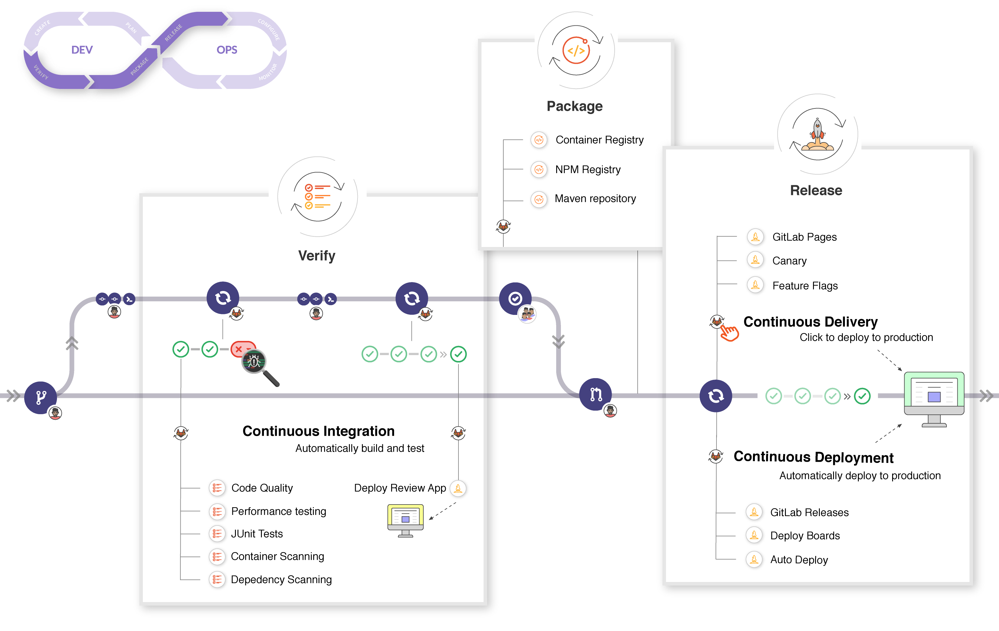

# gitlab在windows上的使用

> 想要启用CI/CD只需要添加.gitlab-ci.yml配置文件就行

## gitlab 的CI/CD如何工作的

目的就是要实现自动化编译，测试，部署和交付。

这其中有三个重要的概念：

- 持续集成
  
  每次提交代码都可以对整个git库进行`build`，`test`过程，通过自定义的脚本实现定制化的功能需求

- 持续交付
  
  与集成不同的时，当代码编写到一个阶段时，就需要部署。而部署都是那些有特权的人才能够**一键部署**，而这整个过程中是需要人为干预的。

- 持续部署
  
  和持续交付类似，不同的就是持续部署不需要人为操作，会自动部署。例如每次合并到master分支之后，就需要进行自动化。

`.gitlab-ci.yml`文件中你可以配置发布是否需要人为操作或者自动部署。

```shell
before_script:
  - apt-get install rubygems ruby-dev -y

run-test:
  script:
    - ruby --version
```

  **before_script**

  一般是在`build`，`test`之前的给项目安装依赖包。

  **run-test**
  一个`job`，并在runner中执行对应的脚本。同时还可以展示执行过程中的详细过程

  

以上这两者组成了一个`pipeline`，当每次上传代码的时候会出发这个操作。

接下来看看gitlab的CI/CD功能的整个工作流程吧：



